# DrawableToolbox
[](https://github.com/duanhong169/DrawableToolbox/releases)
[](https://developer.android.com/index.html)
<a target="_blank" href="https://android-arsenal.com/api?level=14"></a>
[](https://github.com/duanhong169/DrawableToolbox/blob/master/LICENSE)
[](https://github.com/KotlinBy/awesome-kotlin)

[English](README.md) | 中文

功能完备的Drawable工具箱，通过代码构建种类多样的Drawable，摆脱枯燥重复的`drawable.xml`文件。

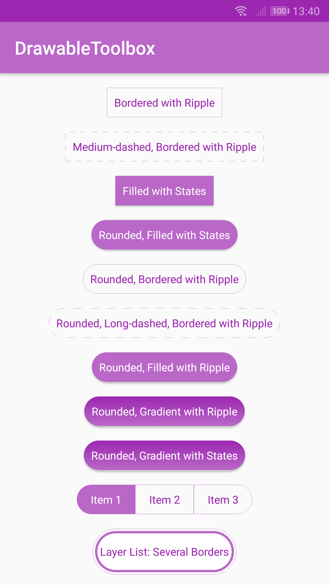 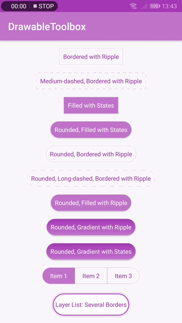 <br/>
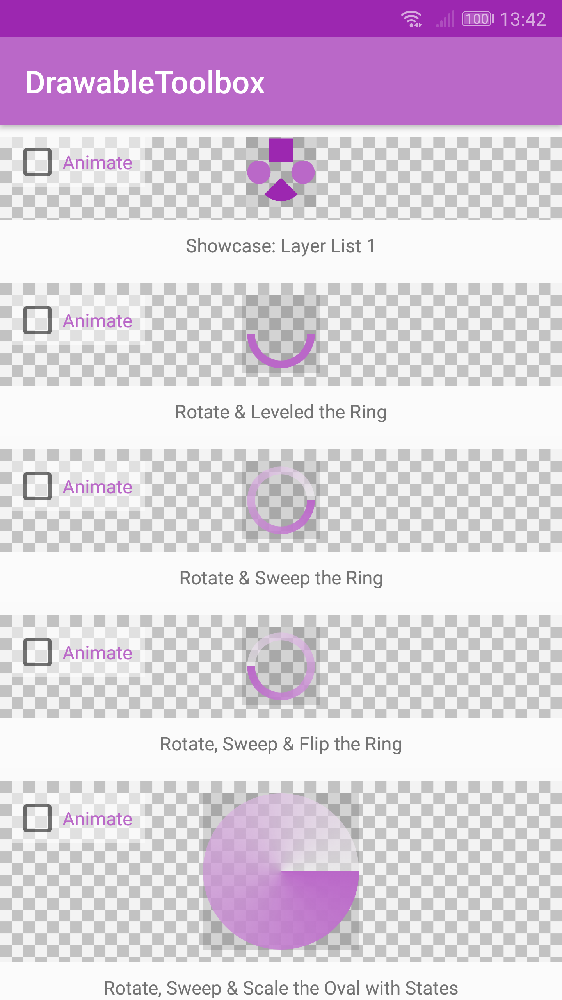 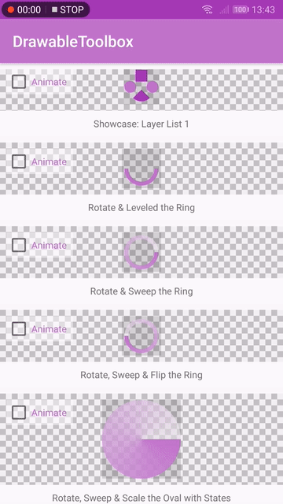

## 功能

* 通过代码构建Drawable
* 支持`<shape>`，`<rotate>`，`<scale>`，`<ripple>`，`<layer-list>`等类型的drawable
* 支持镜面翻转（水平或垂直方向）

## 参与本项目

* 如果你有需要的功能，请提[Issue](https://github.com/duanhong169/DrawableToolbox/issues)或[Pull request](https://github.com/duanhong169/DrawableToolbox/pulls)

## Gradle

```
dependencies {
    implementation 'com.github.duanhong169:drawabletoolbox:${latestVersion}'
    ...
}
```

> 将上方的`${latestVersion}`替换为当前最新的版本号，最新版本号参见[releases](https://github.com/duanhong169/DrawableToolbox/releases)。

## 使用说明

通过`DrawableBuilder`来配置`Drawable`， 然后使用`build()`构建得到`Drawable`对象。

> 完整支持的API请参见[DrawableBuilder.kt](https://github.com/duanhong169/DrawableToolbox/blob/master/drawabletoolbox/src/main/java/top/defaults/drawabletoolbox/DrawableBuilder.kt)。

如下是一些示例代码和对应得到的`Drawable`：

代码：

```kotlin
DrawableBuilder()
        .rectangle()
        .hairlineBordered()
        .strokeColor(COLOR_DEFAULT)
        .strokeColorPressed(COLOR_PRESSED)
        .ripple()
        .build()
```

结果：

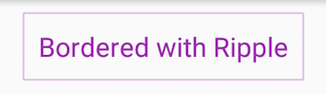

代码：

```kotlin
DrawableBuilder()
        .rectangle()
        .hairlineBordered()
        .mediumDashed()
        .strokeColor(COLOR_DEFAULT)
        .strokeColorPressed(COLOR_PRESSED)
        .ripple()
        .build()
```

结果：

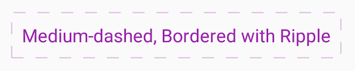

代码：

```kotlin
DrawableBuilder()
        .rectangle()
        .rounded()
        .solidColor(COLOR_DEFAULT)
        .solidColorPressed(COLOR_PRESSED)
        .build()
```

结果：

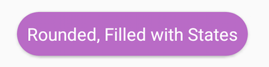

代码：

```kotlin
DrawableBuilder()
        .rectangle()
        .hairlineBordered()
        .longDashed()
        .rounded()
        .strokeColor(COLOR_DEFAULT)
        .strokeColorPressed(COLOR_PRESSED)
        .ripple()
        .build()
```

结果：

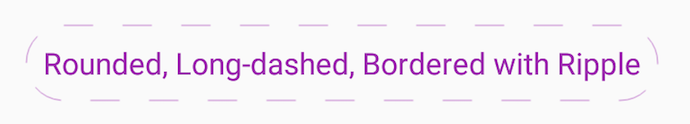

代码：

```kotlin
DrawableBuilder()
        .rectangle()
        .rounded()
        .gradient()
        .linearGradient()
        .angle(90)
        .startColor(COLOR_DEFAULT)
        .endColor(ContextCompat.getColor(context, R.color.colorPrimaryDark))
        .ripple()
        .rippleColor(COLOR_PRESSED)
        .build()
```

结果：

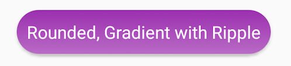

代码：

```kotlin
val baseBuilder = DrawableBuilder()
        .rectangle()
        .rounded()
        .gradient()
        .gradientType(GradientDrawable.LINEAR_GRADIENT)
        .angle(90)
val normalState = baseBuilder
        .startColor(COLOR_DEFAULT)
        .endColor(ContextCompat.getColor(context, R.color.colorPrimaryDark))
        .build()
val pressedState = baseBuilder
        .startColor(COLOR_PRESSED)
        .endColor(ContextCompat.getColor(context, R.color.colorAccentDark))
        .build()

StateListDrawableBuilder()
        .normal(normalState)
        .pressed(pressedState)
        .build()
```

结果：

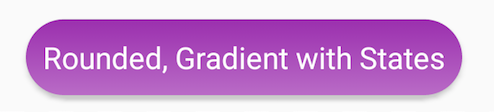

代码：

```kotlin
val baseBuilder = DrawableBuilder()
        .rectangle()
        .rounded()
        .hairlineBordered()
        .strokeColor(COLOR_DEFAULT)
        .solidColorSelected(COLOR_DEFAULT)
        .ripple()

return when(type) {
    SegmentedControlDrawableSpec.TYPE_LEFT_MOST -> {
        baseBuilder.topRightRadius(0)
                .bottomRightRadius(0)
                .build()
    }
    SegmentedControlDrawableSpec.TYPE_RIGHT_MOST -> {
        baseBuilder.topLeftRadius(0)
                .bottomLeftRadius(0)
                .build()
    }
    else -> {
        baseBuilder.cornerRadius(0).build()
    }
}
```

结果：

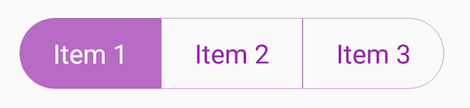

代码：

```kotlin
val layer1 = DrawableBuilder()
        .size(200)
        .rectangle()
        .rounded()
        .hairlineBordered()
        .strokeColor(COLOR_DEFAULT)
        .strokeColorPressed(COLOR_PRESSED)
        .build()
val layer2 = DrawableBuilder()
        .rectangle()
        .rounded()
        .solidColor(COLOR_DEFAULT)
        .build()
val layer3 = DrawableBuilder()
        .rectangle()
        .rounded()
        .solidColor(Color.WHITE)
        .ripple()
        .rippleColor(COLOR_DEFAULT)
        .build()
LayerDrawableBuilder()
        .add(layer1)
        .add(layer2)
        .inset(10)
        .add(layer3)
        .inset(20)
        .build()
```

结果：

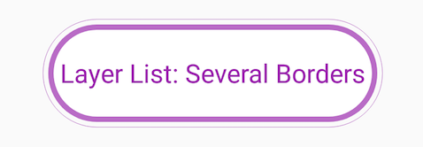

代码：

```kotlin
val layer1 = DrawableBuilder()
        .size(180)
        .rectangle()
        .build()
val layer2 = DrawableBuilder()
        .oval()
        .solidColor(COLOR_DEFAULT)
        .build()
val layer3 = DrawableBuilder()
        .rectangle()
        .solidColor(COLOR_DEFAULT_DARK)
        .rotate(45f)
        .build()
val layer4 = DrawableBuilder()
        .rectangle()
        .bottomLeftRadius(100)
        .solidColor(COLOR_DEFAULT_DARK)
        .build()
val layer5 = DrawableBuilder()
        .oval()
        .solidColor(COLOR_DEFAULT)
        .build()
val layerDrawable = LayerDrawableBuilder()
        .add(layer1)
        .add(layer2)
        .inset(20, 20, 100, 100)
        .add(layer3)
        .inset(100, 20, 20, 100)
        .add(layer4)
        .inset(20, 100, 100, 20)
        .add(layer5)
        .inset(100, 100, 20, 20)
        .build()
DrawableBuilder()
        .baseDrawable(layerDrawable)
        .rotate(0f, 360f)
        .build()
```

结果：

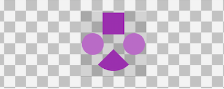

代码：

```kotlin
// Rotate & Leveled the Ring
DrawableBuilder()
        .size(200)
        .ring()
        .useLevelForRing()
        .solidColor(COLOR_DEFAULT)
        .innerRadiusRatio(3f)
        .thicknessRatio(10f)
        .rotate(0f, 720f)
        .build()
```

结果：


代码：

```kotlin
// Rotate, Sweep & Flip the Ring
DrawableBuilder()
        .size(200)
        .ring()
        .innerRadiusRatio(3f)
        .thicknessRatio(10f)
        .gradient()
        .sweepGradient()
        .rotate(0f, 360f)
        .flip()
        .build()
```

结果：

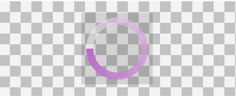

代码：

```kotlin
// Rotate, Sweep & Scale the Oval with States
val baseBuilder = DrawableBuilder()
        .size(400)
        .oval()
        .gradient()
        .sweepGradient()
        .rotate(0f, 360f)
        .scale(0.5f)
        .scaleGravity(Gravity.START or Gravity.TOP)
val normalState = baseBuilder.build()
val pressedState = baseBuilder
        .startColor(COLOR_PRESSED)
        .endColor(0x7FFFFFFF)
        .build()
StateListDrawableBuilder()
        .normal(normalState)
        .pressed(pressedState)
        .build()
```

结果：

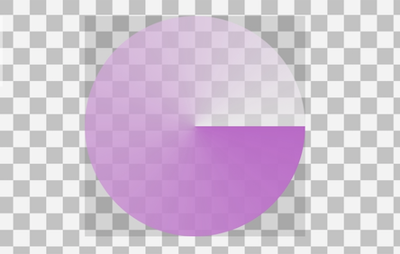

更多的代码示例请查看[SampleCodeSnippets.kt](https://github.com/duanhong169/DrawableToolbox/blob/master/app/src/main/java/top/defaults/drawabletoolboxapp/SampleCodeSnippets.kt)。

## License

    Copyright 2018 Hong Duan

    Licensed under the Apache License, Version 2.0 (the "License");
    you may not use this file except in compliance with the License.
    You may obtain a copy of the License at

        http://www.apache.org/licenses/LICENSE-2.0

    Unless required by applicable law or agreed to in writing, software
    distributed under the License is distributed on an "AS IS" BASIS,
    WITHOUT WARRANTIES OR CONDITIONS OF ANY KIND, either express or implied.
    See the License for the specific language governing permissions and
    limitations under the License.